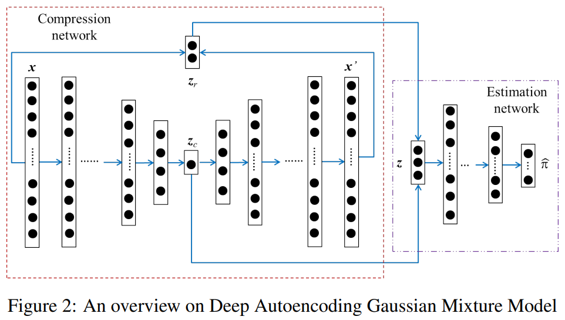
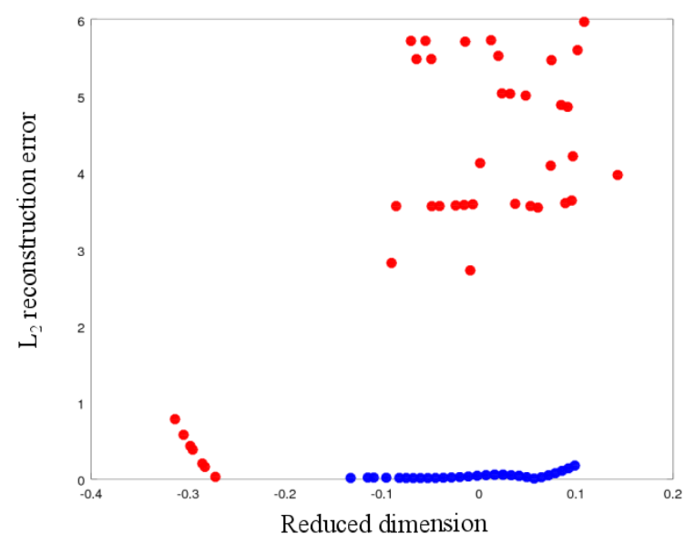

# **DAGMM**

## DEEP AUTOENCODING GAUSSIAN MIXTURE MODEL FOR UNSUPERVISED ANOMALY DETECTION [link](https://openreview.net/pdf?id=BJJLHbb0-)
### **Unofficial DAGMM Implementation**

* DAGMM Structure

* Dataset
  - KDDCUP

* Dimensionality Reduction + Reconstruction loss

* Result

|Precision|Recall|F1-Score|ROC-AUC|
|:-:|:-:|:-:|:-:|
|0.8427|0.9306|0.9432|99.11|

### **References**

- Pytorch- DAGMM [link](https://github.com/mperezcarrasco/PyTorch-DAGMM.git)
